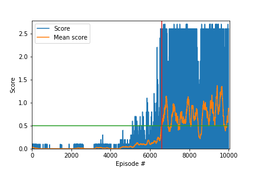

[//]: # (Image References)

[image1]: https://user-images.githubusercontent.com/10624937/42135623-e770e354-7d12-11e8-998d-29fc74429ca2.gif "Trained Agent"
[image2]: https://user-images.githubusercontent.com/10624937/42135622-e55fb586-7d12-11e8-8a54-3c31da15a90a.gif "Soccer"

# Tennis colab compete RL

### Introduction

For this project, we will work with the [Tennis](https://github.com/Unity-Technologies/ml-agents/blob/master/docs/Learning-Environment-Examples.md#tennis) environment.

![Trained Agent][image1]

In this environment, two agents control rackets to bounce a ball over a net. If an agent hits the ball over the net, it receives a reward of +0.1.  If an agent lets a ball hit the ground or hits the ball out of bounds, it receives a reward of -0.01.  Thus, the goal of each agent is to keep the ball in play.

The observation space consists of 8 variables corresponding to the position and velocity of the ball and racket. Each agent receives its own, local observation.  Two continuous actions are available, corresponding to movement toward (or away from) the net, and jumping. 
Before choose an action each agent observes 3 stacked vector observation, so each agent observes a state with length 24.   

- Both the action and the state are continuous.
- The state space has size of 24.
- Each action space has size of 2. Every entry in the action vector should be a number between -1 and 1.
- The task is episodic.

### Solving the Environment

The task is episodic, and in order to solve the environment, the agents must get an average score of +0.5 (over 100 consecutive episodes, after taking the maximum over both agents). Specifically,

- After each episode, we add up the rewards that each agent received (without discounting), to get a score for each agent. This yields 2 (potentially different) scores. We then take the maximum of these 2 scores.
- This yields a single **score** for each episode.

The environment is considered solved, when the average (over 100 episodes) of those **scores** is at least +0.5.

### Getting Started

1. Download the environment from one of the links below.  You need only select the environment that matches your operating system:
    - Linux: [click here](https://s3-us-west-1.amazonaws.com/udacity-drlnd/P3/Tennis/Tennis_Linux.zip)
    - Mac OSX: [click here](https://s3-us-west-1.amazonaws.com/udacity-drlnd/P3/Tennis/Tennis.app.zip)
    - Windows (32-bit): [click here](https://s3-us-west-1.amazonaws.com/udacity-drlnd/P3/Tennis/Tennis_Windows_x86.zip)
    - Windows (64-bit): [click here](https://s3-us-west-1.amazonaws.com/udacity-drlnd/P3/Tennis/Tennis_Windows_x86_64.zip)
    
    (_For Windows users_) Check out [this link](https://support.microsoft.com/en-us/help/827218/how-to-determine-whether-a-computer-is-running-a-32-bit-version-or-64) if you need help with determining if your computer is running a 32-bit version or 64-bit version of the Windows operating system.

    (_For AWS_) If you'd like to train the agent on AWS (and have not [enabled a virtual screen](https://github.com/Unity-Technologies/ml-agents/blob/master/docs/Training-on-Amazon-Web-Service.md)), then please use [this link](https://s3-us-west-1.amazonaws.com/udacity-drlnd/P3/Tennis/Tennis_Linux_NoVis.zip) to obtain the "headless" version of the environment.  You will **not** be able to watch the agent without enabling a virtual screen, but you will be able to train the agent.  (_To watch the agent, you should follow the instructions to [enable a virtual screen](https://github.com/Unity-Technologies/ml-agents/blob/master/docs/Training-on-Amazon-Web-Service.md), and then download the environment for the **Linux** operating system above._)

2. Place the file in this folder, and unzip (or decompress) the file. 

3. Follow the instruction [here](https://github.com/udacity/deep-reinforcement-learning#dependencies) to set up the Python environment.

4. With the active environment use the command: *pip install -r requirements.txt* to install the rest of project dependencies.  

### Instructions

Follow the instructions in `Tennis.ipynb` to get started with training your own agent!  

## Results

The objective was completed using the algorithm deep deterministic policy gradient (DDPG), for more details about the algorithm and architecture used, read the `Report.md`.

The evolution of the score can be seen in the graph below.

When calculating the average of 100 episodes, it is possible to notice that the reward is almost zero until about the episode 4500, there is a slow increase until the 6500 episode, followed by a big increase in the next 300 episodes, after that dominates a large oscillation in the score.
The goal was reached in episode 6598, the first episode which the average of 100 episodes in a row is greater than 0.5.

## Improvements

- Test other hyperparameters.
The DDPG algorithm has the problem of being unstable in some situations and of relying too much on specific hyperparameters to converge.
In this case, it is a good practice to test other hyperparameters, such as increasing or decreasing the number of nodes, changing the learning rate, the gamma value, the buffer size, etc.

- Use TD3, an enhanced version of DDPG.
TD3 is an algorithm that address the most known issues with the ddpg algorithm.
The 3 TD3 improvements are:

1. Uses two critical networks to avoid overestimating the Q-value.
2. Delayed update, only updates the actor network after more than one critical network update.
3. Add noise to the actor to avoid Q-value exploitation.

Note that items 2 and 3 have already been implemented, it only remains to use two critical networks for a full implementation of the TD3 algorithm.
